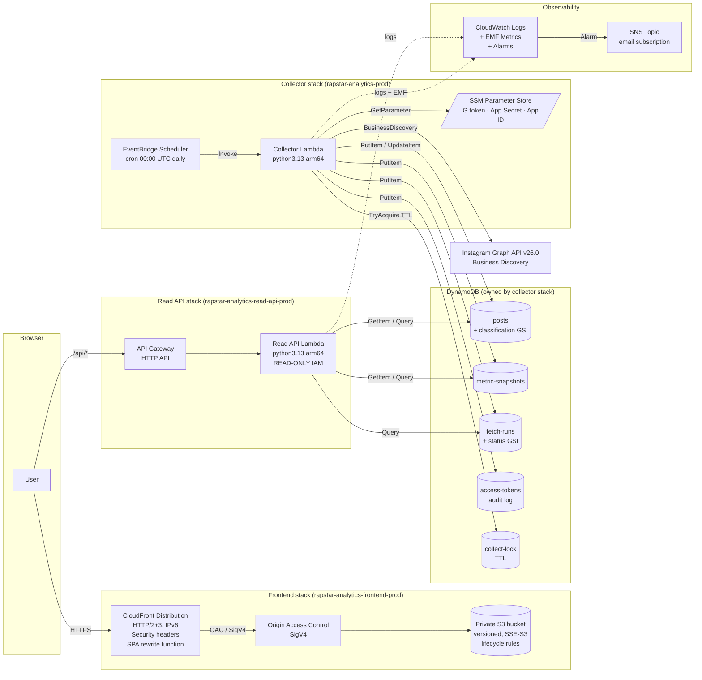

# RAPSTAR Analytics

RAPSTAR 公式 Instagram アカウント (`@rapstar_starz`) に公開された **RAPSTAR 2026 応募動画** の公開指標 (再生数・いいね数・コメント数) を 1 日 1 回自動収集し、累計ランキング / 24h 増加ランキング / 投稿ごとの時系列グラフ / 複数投稿の比較ビューとして可視化する、個人開発の **非公式** 分析 Web アプリです。

RAPSTAR の番組運営・公式アカウントとは一切関係ありません。公式ロゴ・番組ビジュアルは使用していません。

## Live Demo

<https://d1qweahndlkdmg.cloudfront.net>

> 現時点では CloudFront のデフォルトドメインで公開しています。独自ドメインは未設定です。

## 機能

実装されている機能は以下のとおりです (想定ではなく実コードから確認済み):

### ランキングページ (`/`)

- 5 種類のランキング切り替え: **累計 再生数 / いいね / コメント**、**24h 増加 再生 / いいね**
- 24h 増加ランキングは「最新実測値」と「およそ 24h 前 (±6h 許容) の実測値」の差分で算出。両時点の実測値が揃わない投稿は "データ不足" として除外し、実際に比較に使われた時間差を各行に表示
- 投稿から 24h 未満の動画は 24h 増加ランキングから除外し "投稿から 24h 未満" として区別
- 値が取得できなかった投稿は末尾にまとめ、"—" で表示 (0 と区別)

### 投稿詳細ページ (`/posts/:postId`)

- 投稿のメタデータ (投稿日時 / permalink / キャプション先頭から推定したラッパー名)
- 再生数 / いいね / コメントの最新値
- 期間切り替え (24h / 7d / 全期間) × 表示モード切り替え (**累計値 / 増加数**) の時系列グラフ

### 比較ページ (`/compare`)

- 複数投稿の時系列を 1 枚のチャートに重ねて比較 (Recharts)
- プリセット: **Top 10 / 全員 / カスタム選択**
- 累計値 / 増加数 (ベースライン以降の差分) の切り替え
- 期間切り替え (24h / 7d / 全期間)
- "収集回 (collection cycle)" に基づく選択モデル: Read API が `fetch_runs` テーブルの `[started_at, finished_at]` 区間を返し、クリック/ホバー位置からその回を特定して、各系列の "この収集回における実測値" を 1 ショットで表示 (`buildCycles` / `findCycleForTime` / `computeCycleSnapshot`)
- キーボード操作: `←` / `→` で収集回を移動、`Esc` でピン留め解除

### About ページ (`/about`)

- 本サイトの位置づけ・データ取得元・更新頻度・ランキング計算仕様・免責事項を記載

### Read-only API

Frontend が参照する公開 API (読み取り専用 Lambda) の実エンドポイント:

| Method | Path | 用途 |
| --- | --- | --- |
| `GET` | `/api/status` | 最終取得時刻 / エントリ件数 |
| `GET` | `/api/rankings?type=&limit=&cursor=` | 5 種類のランキング |
| `GET` | `/api/posts/{postId}` | 投稿メタ + 最新実測値 |
| `GET` | `/api/posts/{postId}/history?range=24h\|7d\|all` | 時系列 |
| `GET` | `/api/compare?range=&scope=&ids=&metric=` | 複数投稿比較 + `runs` (収集回区間) |
| `OPTIONS` | * | CORS プリフライト |

書き込み系 (`PutItem` / `UpdateItem` / `DeleteItem` / `BatchWriteItem` / `TransactWriteItems`) は IAM ポリシーで完全に排除しています。Instagram のアクセストークンや App Secret は Read API では一切参照しません。

## Architecture

3 つの CloudFormation / SAM スタックに分離し、変更の影響範囲 (blast radius) を限定しています。



### 主なスタック構成の意図

- **Collector スタック (`infrastructure/template.yaml`)** — EventBridge Scheduler が 1 日 1 回 (00:00 UTC = 09:00 JST) Lambda を起動し、Instagram Graph API の Business Discovery で `@rapstar_starz` の投稿を取得して DynamoDB に保存。EMF 経由で `CollectorRunSuccess` / `CollectorRunPartial` / `CollectorRunFailure` / `MetaApiFailure` / `SnapshotsWritten` / `TokenDaysRemaining` を CloudWatch Metrics に送出し、Failure / Partial / トークン残日数 < 7 日 / Lambda Errors ≥ 1 の 4 本のアラームが SNS 経由で通知
- **Read API スタック (`infrastructure/read-api-template.yaml`)** — Frontend が叩く読み取り専用 API。Collector 側 DynamoDB テーブル名を物理名規約 (`rapstar-${env}-posts` 等) で参照しているため、Collector スタック更新時のクロススタック依存はなし
- **Frontend スタック (`infrastructure/frontend-template.yaml`)** — Private S3 + CloudFront OAC。CloudFront Function の viewer-request フックで、ドット無しパス (`/compare` 等) を `/index.html` に書き換えて React Router の SPA ルーティングを成立させる。S3 bucket policy は特定 Distribution ARN からの `s3:GetObject` のみ許可、`BucketOwnerEnforced` で ACL も無効化
- **分離の理由** — フロントのデプロイ churn でデータパイプラインが止まらないように、Collector / Read API / Frontend の 3 スタックは完全に独立 (Export/Import なし)。Collector Lambda の CodeUri は `./collector-lambda/` 配下に絞られており、Makefile builder (`infrastructure/collector-lambda/Makefile`) が manylinux2014_aarch64 の wheel のみを集めてデプロイパッケージを 3.6 MB 程度に抑える

### データ分類ルール

- Instagram キャプションに `#RAPSTAR2026` ハッシュタグが含まれる投稿 → `classification = "entry"` としてランキング対象
- それ以外 → `classification = "unclassified"` (削除せず、ランキングには出さない)
- ラッパー名はキャプション先頭行を `/` で分割した 1 要素目を best-effort で抽出

## 技術スタック

### Frontend (`frontend/`)

- React 18 + TypeScript 5.7
- Vite 5 (dev server / production bundler)
- React Router v6
- TanStack Query v5 (API キャッシュ + リトライ)
- Recharts v2 (時系列チャート)
- Tailwind CSS 3
- Vitest 2 + Testing Library (jsdom)
- Babel plugin: `babel-plugin-react-compiler` (React 18 向けに `target: "18"` 設定)

### Backend (`collector/` + `read_api/`)

- Python 3.13 arm64 (AWS Lambda)
- `requests` (Instagram Graph API 呼び出し)
- `boto3` (DynamoDB / SSM / CloudWatch)
- `SQLAlchemy` 2.0 (ローカル SQLite 用 — AWS 運用では未使用)

### AWS

- Lambda (Python 3.13 arm64) × 2
- API Gateway (HTTP API)
- DynamoDB (PAY_PER_REQUEST, PITR 有効 × 2 テーブル)
- EventBridge Scheduler
- CloudFront + Origin Access Control (SigV4) + CloudFront Function
- S3 (private, versioned, lifecycle)
- SSM Parameter Store (SecureString: IG token / App Secret)
- CloudWatch Logs / Metrics (EMF) / Alarms
- SNS

### IaC

- AWS SAM (CloudFormation Transform)
- Makefile builder for the collector Lambda

## プロジェクト構成

```text
.
├── collector/                      # Collector Lambda ソース
│   ├── aws/handler.py              #   Lambda エントリ (lambda_handler)
│   ├── classifier.py               #   #RAPSTAR2026 判定
│   ├── ig_client.py                #   Business Discovery クライアント
│   ├── pipeline.py                 #   収集ロジック
│   ├── repositories/dynamodb_impl.py  # DynamoDB 永続化
│   └── token_manager.py            #   トークン debug / 長期化
├── read_api/                       # Read-only API Lambda
│   ├── handler.py                  #   ルーティング + CORS
│   └── service.py                  #   DynamoDB クエリ + ランキング集計
├── frontend/                       # React SPA
│   ├── src/{routes,components,lib,api,mocks,test}
│   ├── index.html
│   └── vite.config.ts
├── infrastructure/                 # IaC
│   ├── template.yaml                     # Collector + Scheduler + Alarms
│   ├── read-api-template.yaml            # Read API + HTTP API
│   ├── frontend-template.yaml            # S3 + CloudFront + OAC
│   ├── samconfig.toml.example            # Collector 用デプロイパラメータ雛形
│   ├── read-api-samconfig.toml           # Read API 用デプロイパラメータ
│   └── collector-lambda/{Makefile,requirements.txt,collector-src → ../../collector}
├── scripts/
│   ├── check-sam-build.sh          # ビルド成果物のリーク scan (DB / env / 秘密鍵)
│   ├── deploy-frontend.sh          # dist → S3 sync + CloudFront invalidation
│   ├── install_schedule.sh         # macOS launchd 定期実行 (ローカル代替手段)
│   ├── collect.py                  # ローカルからの手動収集 (SQLite 用、開発補助)
│   ├── exchange_token.py           # 短期 → 長期トークン交換
│   ├── check_token.py              # トークン残日数チェック
│   ├── set_ssm_secret.py           # SSM へのシークレット投入ヘルパー
│   └── verify_ig_api.py            # IG API 疎通確認
├── tests/                          # Python テスト (moto で DynamoDB/SSM をモック)
├── requirements.txt                # 開発兼テスト依存 (boto3, moto, pytest ...)
├── pytest.ini
└── conftest.py                     # repo ルートを sys.path に追加
```

## ローカル開発

### 1. リポジトリをクローン後、Collector 用 SAM 設定ファイルを作成

```bash
cp infrastructure/samconfig.toml.example infrastructure/samconfig.toml
# IgBusinessAccountId を自分の値に書き換える (非 secret だが PUBLIC 履歴に残したくないため gitignore 済)
```

### 2. Python 側セットアップ

```bash
python3.13 -m venv .venv
source .venv/bin/activate
pip install -r requirements.txt
```

テスト実行:

```bash
pytest
```

### 3. Frontend セットアップ

```bash
cd frontend
cp .env.example .env.local
# VITE_API_BASE_URL=<Read API Gateway のベース URL> を記入
#   未記入 or VITE_USE_MOCK=true の場合はローカルモッククライアントで動作
npm ci
npm run dev
```

モック時は上部に "MOCK DATA" バナーが表示されます (`frontend/src/components/MockDataBanner.tsx`)。

### 4. 環境変数 (`collector/` を実機で動かす場合)

ローカル実行用の変数は `.env.example` を参照。実運用 (Lambda) では SSM Parameter Store の以下 3 パラメータを参照:

- `/rapstar-analytics/ig-user-access-token` (SecureString)
- `/rapstar-analytics/meta-app-secret` (SecureString)
- `/rapstar-analytics/meta-app-id` (String)

SSM への投入は `scripts/set_ssm_secret.py` を参照 (トークンは stdin から読み込み、CLI 履歴に残しません)。

## テスト

Python:

```bash
pytest                 # 113 件のテスト、moto で DynamoDB/SSM をモック
```

Frontend:

```bash
cd frontend
npx tsc -b             # 型チェック
npm run test -- --run  # Vitest: 85 件
npm run build          # 本番ビルド
```

## デプロイ

### 前提

- AWS 認証情報 (ap-northeast-1 への権限)
- SAM CLI (`brew install aws-sam-cli` 等)
- Node.js 20+、npm、Python 3.13

### 1) Collector スタック

```bash
cd infrastructure
sam build --template-file template.yaml
../scripts/check-sam-build.sh .aws-sam/build   # DB/env/private key のリークがないことを確認
sam deploy --template-file template.yaml       # samconfig.toml の設定を使用
```

初回デプロイ前に SSM へ値を投入する必要があります:

```bash
python scripts/set_ssm_secret.py /rapstar-analytics/ig-user-access-token   # 長期トークン
python scripts/set_ssm_secret.py /rapstar-analytics/meta-app-secret         # App Secret
aws ssm put-parameter \
  --name /rapstar-analytics/meta-app-id --value <APP_ID> --type String
```

### 2) Read API スタック

```bash
cd infrastructure
sam build --template-file read-api-template.yaml --build-dir .aws-sam/build-read-api
../scripts/check-sam-build.sh .aws-sam/build-read-api
sam deploy \
  --template-file read-api-template.yaml \
  --config-file read-api-samconfig.toml
```

デプロイ後、Outputs の `ReadApiEndpoint` を `frontend/.env.local` の `VITE_API_BASE_URL` に設定します。

### 3) Frontend スタック (インフラ初期化のみ初回必要)

```bash
cd infrastructure
sam deploy --template-file frontend-template.yaml --stack-name rapstar-analytics-frontend-prod \
  --capabilities CAPABILITY_IAM --resolve-s3
```

### 4) Frontend バンドルの配信

```bash
STACK=rapstar-analytics-frontend-prod ./scripts/deploy-frontend.sh
```

このスクリプトは次を自動化します:

- `npm ci` → `npm run build` → `npx tsc -b` → `npm run test`
- `dist/` 内の文字列スキャン (localhost / `AKIA...` / Private Key)
- CloudFormation Outputs から bucket / distribution id を取得
- `dist/assets/*` を 1 年 immutable キャッシュで `--delete` 同期
- `dist/index.html` を `no-cache` でアップロード (最後に)
- CloudFront の `/index.html` だけ invalidation

> AWS 構成の全パラメータはテンプレート本体のコメントを参照してください。

## モニタリング

CloudWatch Metrics (namespace: `RapstarAnalytics`) + CloudWatch Alarms:

| Alarm | Metric | 条件 | 用途 |
| --- | --- | --- | --- |
| `rapstar-prod-collector-run-failure` | `CollectorRunFailure` | ≥1 / 1h | 業務エラー (Meta API 拒否や内部例外) で run 全体が失敗 |
| `rapstar-prod-collector-run-partial` | `CollectorRunPartial` | ≥1 / 1h | 一部投稿のみ失敗 |
| `rapstar-prod-collector-failures` | `AWS/Lambda Errors` | ≥1 / 1h | Lambda 実行自体の失敗 (OOM / timeout 等) |
| `rapstar-prod-token-expiring-soon` | `TokenDaysRemaining` | 最小値 < 7 / 1h | IG トークンの長期化が必要 |

通知先 SNS Topic は `AlarmEmail` パラメータで email 購読を 1 件自動作成します。

## 既知の制限

- 更新頻度は **1 日 1 回** (日本時間 09:00 ごろ)。リアルタイム更新はしません
- Instagram API の仕様変更 / 対象投稿の非公開化 / Rate limit で表示値が実態と乖離する可能性があります
- `/compare` の "収集回" 概念は、Read API が `fetch_runs` を返せる場合は authoritative、それ以前のバックエンドでは可視測定時刻のクラスタリングから推定した fallback cycle を使います
- Read API の CORS は現時点で `Access-Control-Allow-Origin: *` (独自ドメイン移行時にタイト化予定)
- 現在のバンドルサイズは 655 KB (gzip 196 KB) — Recharts の tree-shaking が主因、将来的なコード分割の余地あり

## 免責事項

本サイトは **非公式** のツールです。RAPSTAR の番組運営・公式スタッフ・公式 Instagram アカウントとは一切関係ありません。表示されている数値は Instagram の公開 Graph API 経由で取得した **公開指標** を元に算出した参考値で、公式スコアや公式ランキングではありません。
